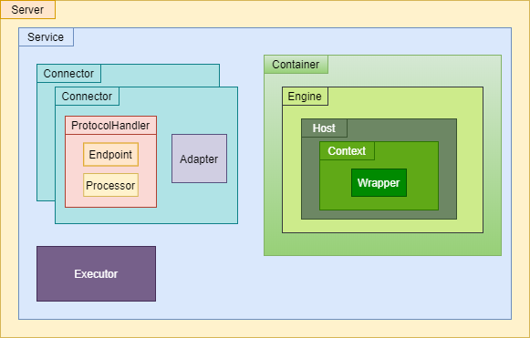
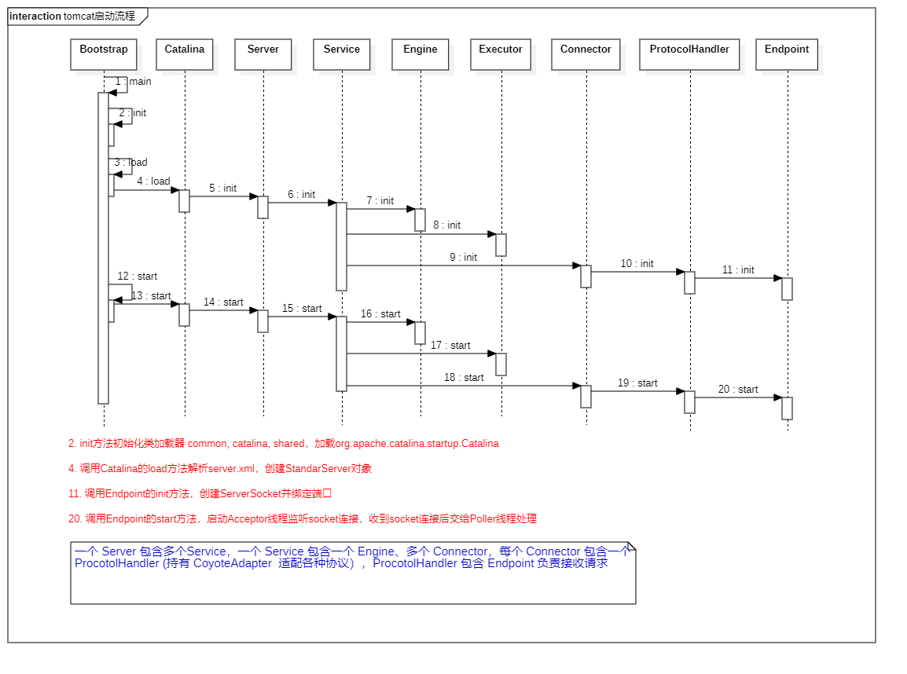
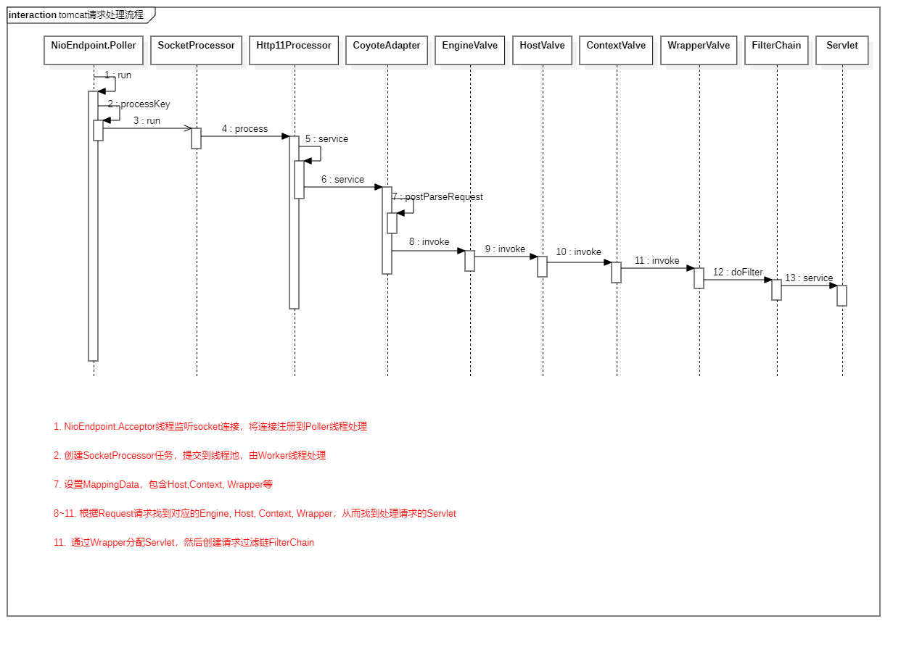

# Tomcat Misc

## Tomcat体系结构

### Server

一个Server可以包含多个Service

#### Service

一个Service由多个Connector和一个Container组成，可以包含共享的线程池

##### Connector

tomcat的连接器，负责接收请求，并将请求交给Container处理

* Endpoint
  
  负责监听Socket连接，建立TCP 3次握手，并将Socket连接交给Processor处理

* Processor
  
  接收Socket读取输入流，封装tomcat自身的Request和Response，将Request和Response交给CoyoteAdapter处理

* ProtocolHandler
  
  处理协议和IO，tomcat提供6个实现类：AjpNioProtocol，AjpAprProtocol，AjpNio2Protocol，Http11NioProtocol，Http11Nio2Protocol，Http11AprProtocol，一般使用Http11NioProtocol

* Adapter
  
  实现类CoyoteAdapter，将不同协议的请求内容适配成标准的HttpServletRequest和HttpServletResponse，再交给Container处理

##### Container

Servlet容器，负责加载和管理Servlet，将请求交给具体的Servlet处理

* Engine
  
  Servlet容器引擎，一个Engine管理多个Host，负责将请求发送到对应的Host处理

* Host

  表示虚拟主机，一个Host可以包含多个Context，负责将请求发送到对应的Context处理

* Context
  
  表示一个web应用，一个Context可以包含多个Wrapper，负责将请求发送到对应的Wrapper处理

* Wrapper
  
  表示一个Servlet，最终调用Servlet.service方法

## Tomcat启动流程

## Tomcat请求处理流程

